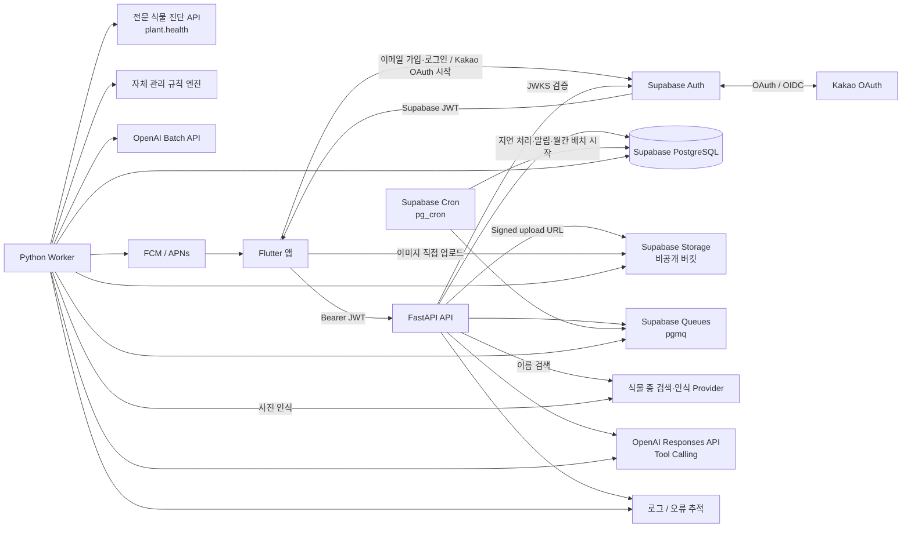
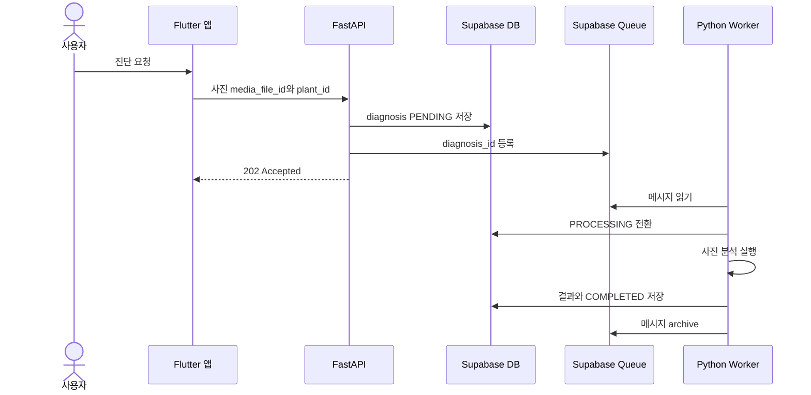
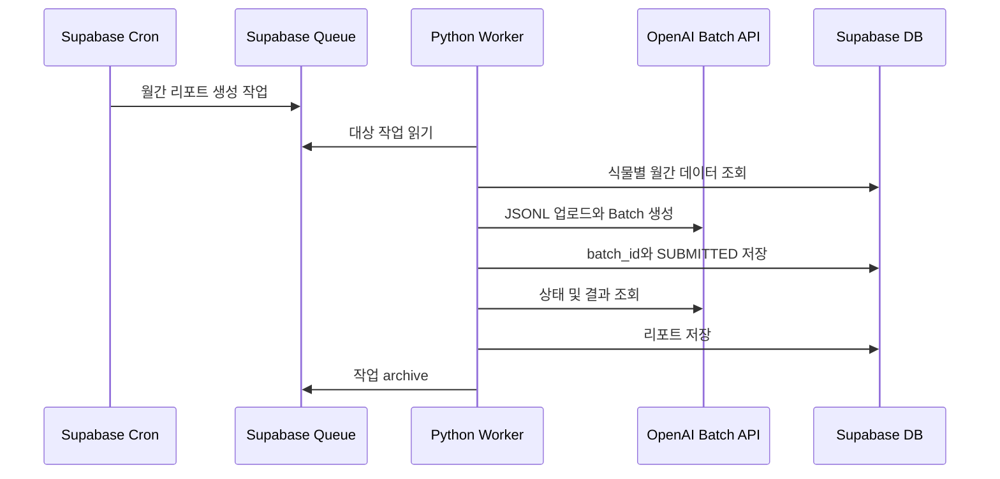
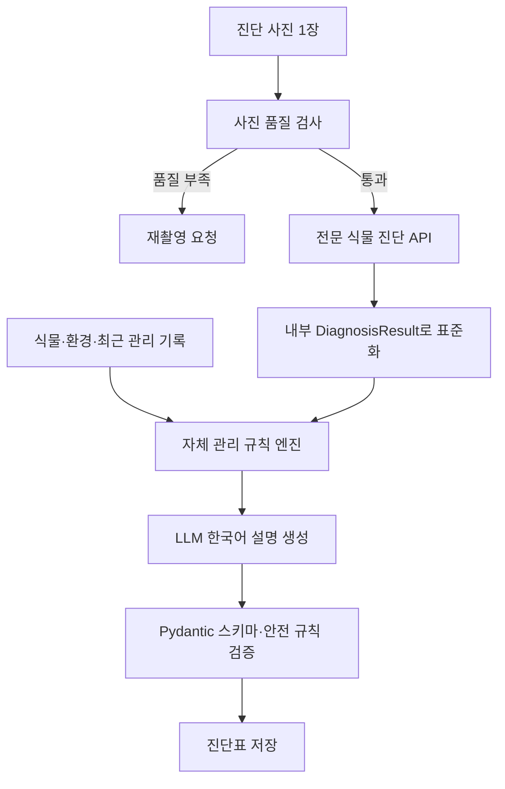
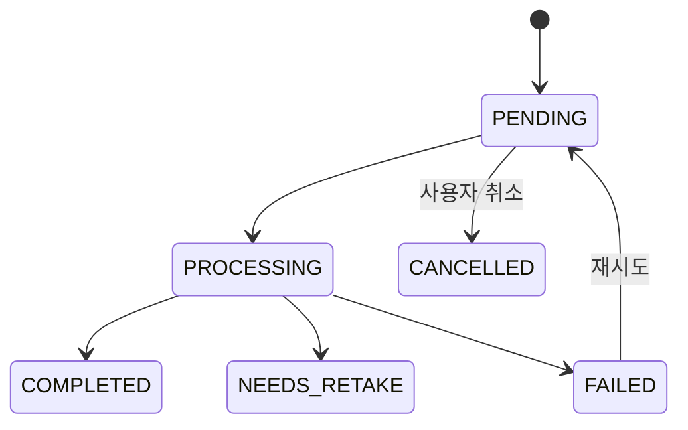

# 시스템 아키텍처

## 1. 최종 결정

출시 구조는 **모듈형 모놀리스 FastAPI + Supabase + 독립 Python Worker**로
구성합니다.

- 인증은 Supabase Auth의 이메일·비밀번호와 Kakao OAuth를 사용합니다.
- 이메일 가입은 이메일 인증 완료 전 세션을 발급하지 않습니다.
- 데이터베이스는 Supabase PostgreSQL을 사용합니다.
- 사용자 이미지는 비공개 Supabase Storage 버킷에 저장합니다.
- 비동기 작업 큐는 Supabase Queues(`pgmq`)를 사용합니다.
- 반복 실행은 Supabase Cron(`pg_cron`)을 사용합니다.
- 실시간 AI 상담은 OpenAI Responses API의 Tool Calling을 사용합니다.
- 오래 걸려도 되는 대량 AI 처리는 OpenAI Batch API를 사용합니다.
- FastAPI API와 Worker는 같은 저장소와 애플리케이션 코드를 공유하지만 별도 프로세스로 배포합니다.
- Docker는 필수가 아닙니다. 배포 환경 통일이 필요해질 때 추가합니다.

## 2. 전체 구조



Supabase는 인증, PostgreSQL, 파일 저장소, Queue, Cron을 담당합니다. FastAPI는
소유권 검증과 핵심 비즈니스 규칙을 담당하며 앱이 업무 테이블을 직접 변경하지
않도록 합니다.

## 3. 배포 프로세스

같은 백엔드 저장소를 아래 두 프로세스로 실행합니다.

```bash
# API
uvicorn app.main:app --host 0.0.0.0 --port $PORT

# Worker
python -m app.worker
```

초기에는 Python 배포를 지원하는 플랫폼에서 API 서비스와 Worker 서비스를 각각
실행합니다. Docker 없이 배포할 수 있으며 두 프로세스는 같은 커밋과 환경변수를
사용합니다.

```text
backend/
├── app/
│   ├── main.py
│   ├── worker.py
│   ├── core/                 # 설정, JWT 검증, 로깅, 공통 예외
│   ├── db/                   # SQLAlchemy 세션, 트랜잭션
│   ├── api/v1/               # FastAPI 라우터
│   ├── models/               # 업무 테이블 모델
│   ├── schemas/              # Pydantic 요청·응답
│   ├── services/             # 비즈니스 규칙
│   ├── tasks/                # 진단, Batch, 알림 작업
│   ├── ai/                   # Tool registry, prompts, response loop
│   └── integrations/         # Supabase, OpenAI, Push 구현체
├── alembic/
├── tests/
└── pyproject.toml
```

## 4. 인증과 권한

1. Flutter 앱은 이메일·비밀번호 또는 Supabase Kakao Provider로 인증합니다.
2. 이메일 가입은 `Confirm email`을 활성화해 인증 전 세션을 발급하지 않습니다.
3. 카카오 로그인은 PKCE와 등록된 앱 deep link를 사용하고 OAuth 성공 후 세션을 확인합니다.
4. Kakao Biz App의 `account_email` 동의를 사용하고 이메일 없는 계정은 허용하지 않습니다.
5. 동일한 검증 이메일의 identity는 Supabase Auth의 동일 사용자로 연결합니다.
6. Flutter 앱은 Supabase Access Token을 FastAPI의 Bearer Token으로 전달합니다.
7. FastAPI는 로그인 방식과 무관하게 Supabase JWKS로 JWT의 서명, 만료, 발급자, 대상을 검증합니다.
8. JWT의 `sub`를 현재 사용자 ID로 사용하고 모든 사용자 리소스의 소유권을 확인합니다.

Supabase `service_role` 키와 OpenAI API Key는 Worker와 FastAPI 환경변수에만
저장합니다. Kakao Client Secret은 Supabase Provider 설정에만 저장합니다.
비밀번호와 Refresh Token은 Supabase Auth가 관리하므로 애플리케이션 DB와 Flutter
앱에 저장하지 않습니다.

### iOS 출시 게이트

Kakao OAuth는 사용자의 기본 계정을 인증하는 제3자 로그인입니다. App Store 제출
전 Apple App Review Guidelines 4.8의 이름·이메일 최소 수집, 이메일 비공개,
광고 목적 상호작용 추적 제한 요건을 만족하는 동등한 로그인 옵션을 추가해야 합니다.
현재 구조에서는 Supabase Auth의 Sign in with Apple을 iOS 출시 필수 작업으로
간주합니다. 이메일·비밀번호 로그인만으로 이 출시 게이트를 충족한 것으로 보지
않습니다.

## 5. 이미지 저장

- 프로필, 식물명칭 인식, 다이어리, 진단, AI 채팅 이미지는 Supabase Storage 비공개 버킷에 저장합니다.
- FastAPI가 사용자와 목적에 맞는 경로를 생성하고 Signed Upload URL을 발급합니다.
- Flutter 앱은 Signed URL로 Storage에 직접 업로드합니다.
- 업로드 완료 후 FastAPI가 파일 존재, 크기, MIME type, signature를 검사합니다.
- DB에는 버킷명, object path, MIME type, 크기, checksum만 저장합니다.
- 조회할 때는 짧게 만료되는 Signed Download URL을 발급합니다.
- EXIF 위치 정보는 제거하고 탈퇴·삭제 시 Storage 객체도 비동기로 삭제합니다.

## 6. Queue와 Worker

FastAPI는 오래 걸리는 작업을 HTTP 요청 안에서 실행하지 않습니다.



Queue 메시지에는 리소스 ID와 작업 종류만 넣고 원본 사진이나 긴 프롬프트는 넣지
않습니다. Worker는 DB에서 최신 상태를 다시 읽습니다.

Worker 작업:

- 식물명칭 사진 인식
- 사진 기반 상태 진단
- AI 채팅 이미지 분석
- OpenAI Batch 제출과 결과 수집
- 푸시 알림 발송
- Storage 파일 삭제

각 작업은 리소스 ID를 멱등성 키로 사용합니다. visibility timeout, 최대 재시도
횟수, `failure_code`를 두고 성공한 메시지는 archive합니다.

## 7. 관리 일정 자동화

- 자동 반복은 물주기와 분갈이만 지원합니다.
- 완료 API가 요청을 받은 서버 현재 시각을 실제 완료 시각으로 저장합니다.
- 사용자는 완료 시각을 수정하거나 과거로 입력할 수 없습니다.
- 다음 예정일은 완료 시각을 사용자 시간대 날짜로 변환한 뒤 간격을 더해 계산합니다.
- 예정일이 지나면 Supabase Cron이 이벤트를 `OVERDUE`로 변경합니다.
- 미완료 이벤트의 날짜를 임의로 다음 날짜로 옮기지 않습니다.
- 비료와 가지치기는 진단 결과에서 권장만 하고 사용자가 승인할 때 일회성 일정으로 만듭니다.

Supabase Cron은 지연 상태 처리, 알림 대상 수집, 월간 Batch 시작만 담당합니다.
AI 호출처럼 오래 걸리는 작업은 Queue에 넣고 Worker가 처리합니다.

## 8. 실시간 Tool Calling

AI 채팅은 OpenAI Responses API를 사용합니다. 대화방 하나는 식물 하나에 고정되고
FastAPI가 대화방의 `plant_id`와 현재 사용자 ID를 도구 실행 컨텍스트에 주입합니다.
모델이 임의의 사용자 ID나 식물 ID를 선택하게 하지 않습니다.

읽기 도구:

```text
get_plant_profile
get_plant_environment
get_care_schedule
get_recent_care_events
get_recent_diaries
get_latest_diagnosis
get_today_tasks
get_condition_trend
```

쓰기 제안 도구:

```text
propose_one_time_care_task
```

읽기 도구는 서버가 즉시 실행할 수 있습니다. 데이터 변경은 모델이 직접 실행하지
않고 `AI_ACTIONS`에 `PENDING_CONFIRMATION`으로 저장합니다. 앱이 제안 내용을
보여주고 사용자가 확인 API를 호출한 뒤에만 비료·가지치기 같은 일회성 일정을
추가합니다. 물주기·분갈이 완료는 기존 일정 화면의 완료 버튼으로만 처리합니다.

모든 도구 호출은 이름, 검증된 인자, 결과 요약, 지연 시간, 성공 여부를
`AI_TOOL_CALLS`에 기록합니다. 비밀값과 원본 사진은 기록하지 않습니다.

## 9. OpenAI Batch

OpenAI Batch API는 실시간 채팅과 사진 진단에 사용하지 않습니다. 24시간 안에
완료되면 되는 대량 AI 작업에 사용합니다.

초기 Batch 작업:

- 식물별 월간 AI 케어 리포트 생성
- 과거 다이어리 요약 재생성
- 프롬프트 버전 변경 후 기존 진단 품질 평가
- 대량 임베딩 또는 분류 작업



`custom_id`는 Batch 항목과 식물·월을 연결하고, Batch 결과를 여러 번 수집해도
같은 월간 리포트가 중복 생성되지 않도록 unique 제약과 upsert를 사용합니다.

## 10. 사진 상태 진단

출시 초기에는 자체 분류 모델을 학습하지 않고 **전문 식물 진단 API + 자체 관리
규칙 엔진 + LLM 설명 생성**을 사용합니다. 전문 진단 API가 가능한 원인과
원인별 확률을 제공하고, 자체 엔진이 식물 정보와 관리 이력을 반영하며, LLM은
검증된 결과를 자연스러운 한국어로 설명하는 역할만 담당합니다.



진단 사진은 정확히 한 장입니다. 사진 품질 검사에서는 식물이 실제로 보이는지,
사진이 지나치게 흐리거나 어둡지 않은지, 증상 부위가 충분히 보이는지 확인합니다.
품질이 낮거나 식물 또는 증상 부위가 명확하지 않으면 결과를 억지로 만들지 않고
`NEEDS_RETAKE`로 전환합니다.

전문 진단 API 호출에는 등록된 식물 종 정보를 컨텍스트로 전달하되 종 식별을
매번 다시 요청하지 않습니다. 제공자 응답은 애플리케이션 내부
`DiagnosisResult` 형식으로 변환하고 UI가 외부 제공자의 응답 구조에 직접
의존하지 않게 합니다.

내부 결과는 다음 항목으로 구성합니다.

- `HEALTHY`, `UNHEALTHY`, `UNCERTAIN` 중 하나인 전체 상태
- 사진에서 관찰된 증상
- 가능한 원인 최대 세 개와 제공자가 반환한 원인별 확률
- 지금 해야 할 일, 피해야 할 행동, 예방 방법
- 재확인 권장일과 사유

전체 건강점수나 근거 없는 단일 신뢰도는 생성하지 않습니다. 원인별 확률도
전문 진단 API가 반환한 경우에만 표시하고 LLM이 임의로 만들지 않습니다.

자체 관리 규칙 엔진은 등록된 식물 종, 환경, 마지막 물주기·분갈이 완료 시각,
최근 일정과 다이어리 기록을 사용합니다. 진단 결과만으로 반복 일정을 자동
변경하지 않으며, 비료·가지치기 같은 일회성 제안도 사용자가 승인한 뒤에만
일정에 반영합니다.

LLM은 원인 추가, 확률 변경, 확정적 병명 판단을 할 수 없습니다. 표준화된 진단
결과와 관리 규칙의 출력만 요약하며 결과는 Pydantic JSON Schema와 금지 표현
규칙을 통과해야 저장됩니다. 판단 근거가 부족하면 `UNCERTAIN`과 재촬영 또는
재확인 안내를 반환합니다.

외부 연동은 다음 인터페이스 뒤에 둡니다.

```text
DiagnosisProvider
├── KindwiseDiagnosisProvider    # 출시 초기 주 진단기
├── VisionObservationProvider    # 선택적 증상 관찰 보조, 자동 대체 진단 금지
└── OwnModelProvider             # 검수 데이터 축적 후 추가
```

자체 모델은 사용자 동의를 받은 사진, 후속 상태, 전문가 검수 라벨이 충분히
쌓인 뒤 도입합니다. 초기에는 `정상`, `수분 스트레스`, `빛 스트레스`,
`병해충 의심`, `판별 불가`처럼 제한된 사전 분류부터 검증하고 불확실한 요청은
전문 진단 API로 보내는 방식으로 확장합니다.

진단 상태:



비용 관리를 위해 같은 사용자의 중복 요청은 `media checksum + plant_id +
입력 컨텍스트 버전`으로 감지하고, 사용자별 사용량 제한과 외부 API 비용을
기록합니다. 제공자 장애 시 무근거 대체 진단을 생성하지 않고 재시도하거나
일시 실패로 안내합니다.

## 11. 운영과 장애 처리

- API와 Worker에 timeout, 지수 백오프, 최대 재시도 횟수를 둡니다.
- Queue 메시지와 외부 API 요청은 멱등적으로 처리합니다.
- 진단 제공자·모델, 설명 LLM·모델, 프롬프트, 관리 규칙 버전을 각각 저장합니다.
- 외부 진단 API와 OpenAI 요청의 응답 ID, 지연 시간, 사용량과 비용을 기록합니다.
- 앱은 비동기 작업의 `PENDING`, `PROCESSING`, `COMPLETED`, `NEEDS_RETAKE`,
  `FAILED`를 표시합니다.
- Queue 길이, 가장 오래된 메시지, 진단 실패율, Tool 실패율, Batch 실패율을 모니터링합니다.
- 운영 로그에 JWT, API Key, 원본 사진, AI 대화 전문을 남기지 않습니다.
- DB migration은 배포 전에 수행하고 하위 호환 API 변경을 우선합니다.

## 12. 팀 분담

| 담당 A | 담당 B | 공동 |
|---|---|---|
| 사용자 프로필, 식물, 다이어리, 일정, 캘린더 | Storage, Worker, AI 진단, Tool Calling, Batch, 알림 | Supabase 설정, DB migration, OpenAPI 검토, 배포, 코드 리뷰 |

## 13. 공식 문서

- [Supabase Auth 이메일 가입](https://supabase.com/docs/reference/python/auth-signup)
- [Supabase JWT 검증](https://supabase.com/docs/guides/auth/jwts)
- [Supabase Storage Signed Upload](https://supabase.com/docs/reference/python/storage-from-createsigneduploadurl)
- [Supabase Queues](https://supabase.com/docs/guides/queues)
- [Supabase Cron](https://supabase.com/docs/guides/cron)
- [OpenAI Responses API와 Tool Calling](https://developers.openai.com/api/docs/guides/latest-model)
- [OpenAI Batch API](https://platform.openai.com/docs/api-reference/batch/object?api-mode=responses)
- [Kindwise plant.health](https://www.kindwise.com/plant-health)
- [Kindwise API 보안 및 가격 FAQ](https://www.kindwise.com/faq)
