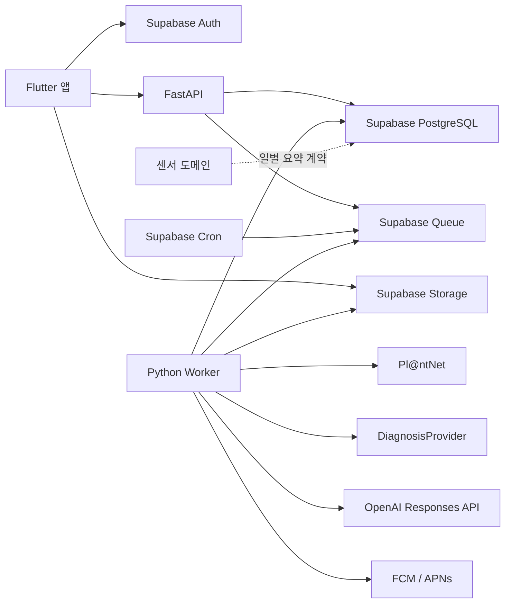

# 시스템 아키텍처

## 1. 제품 기준

- Flutter 앱, FastAPI API, Python Worker를 한 저장소에서 관리합니다.
- 인증, PostgreSQL, Storage, Queue, Cron은 Supabase를 사용합니다.
- 식물 종 인식은 Pl@ntNet, 상태 진단은 교체 가능한 `DiagnosisProvider`를 사용합니다.
- 기존 AI 채팅과 Tool Calling은 제품에서 제거합니다.
- OpenAI는 다이어리 한 건에 대응하는 식물 편지 한 통을 생성할 때만 사용합니다.
- 센서 연결, 원시 측정값, 일별 집계와 상태 판정은 별도 담당 영역입니다. 이 문서는 센서
  결과를 소비하는 경계만 정의합니다.

## 2. 전체 구조



FastAPI는 인증, 소유권, 입력 검증과 짧은 트랜잭션을 담당합니다. 외부 API 호출,
편지 생성, 푸시 발송과 파일 삭제처럼 오래 걸리는 작업은 Queue와 Worker가 담당합니다.

## 3. 인증과 계정

- 이메일·비밀번호 회원가입은 이메일 인증 링크를 사용합니다.
- OAuth는 Naver, Kakao, Apple을 지원합니다.
- OAuth 최초 로그인 사용자는 닉네임 입력을 완료해야 앱에 진입할 수 있습니다.
- 이메일 가입은 비밀번호 확인과 필수 약관 동의를 앱에서 검증하고 닉네임을
  `leafie_nickname` 사용자 메타데이터로 전달합니다.
- 비밀번호 재설정 링크는 앱 딥링크로 돌아오고 앱에서 새 비밀번호를 입력합니다.
- 마이페이지는 닉네임·이메일·함께한 기간, 닉네임 변경, 비밀번호 변경, 앱 알림,
  로그아웃과 회원 탈퇴를 제공합니다.
- 프로필 사진과 한 줄 소개는 사용하지 않습니다.

FastAPI는 비밀번호를 받거나 저장하지 않습니다. 모든 보호 API는 Supabase JWT를
검증하고 DB 조회 시 사용자 소유권을 다시 확인합니다.

## 4. 미디어

- 비공개 `leafie-media` 버킷과 만료 시간이 짧은 Signed URL을 사용합니다.
- 앱은 업로드 URL을 발급받아 Storage에 직접 업로드하고 API에 완료를 통지합니다.
- 등록 인식 사진은 식물 대표 사진으로 재사용합니다.
- 다이어리는 사진을 최대 한 장, 진단은 정확히 한 장 사용합니다.
- JPEG와 PNG를 지원하고 HEIC는 앱에서 JPEG로 변환합니다.
- 삭제·교체된 파일은 DB에서 soft delete한 뒤 Worker가 Storage 객체를 삭제합니다.

## 5. 식물 등록

```text
애칭 입력
→ 지원 23종 검색 또는 카메라·갤러리 사진 인식
→ 후보 확인
→ 아니에요 선택 시 다음 후보, 후보 소진 시 검색 화면
→ 장소 별명, 식물 시작일, 선택적 마지막 물 준 날과 분갈이 날짜 입력
→ 성격 선택
→ 컬러·헤어 선택
→ 최종 확인 및 등록
```

- 사용자가 고르는 식물 종류는 대분류가 아닌 정확한 23개 식물 종입니다.
- 대분류 7개는 선택된 종에서 파생하며 등록 입력값으로 받지 않습니다.
- 분갈이 날짜는 선택값이며 모르면 `null`입니다.
- 성격 코드는 기존 계약의 `OUTGOING`, `CHIC`, `CUTE`, `CRUSH`, `INTROVERTED`,
  `CHUNGCHEONG` 여섯 가지를 유지합니다.
- 화면 표시는 각각 외향적인, 시크한, 귀여운, 짝사랑, 내성적인, 충청도 말투입니다.
- 장식, 화분 재질, 위치 분류와 컨디션은 등록 데이터가 아닙니다.
- 등록 중 임시저장은 Flutter 로컬 저장소에서 처리합니다.
- `client_registration_id`와 요청 해시로 네트워크 재전송을 멱등하게 처리합니다.

## 6. 홈

- 한 번에 선택 식물의 방을 표시하고 좌우 스와이프로 식물을 전환합니다.
- 상단 `D+`는 식물 시작 당일을 1일로 계산합니다.
- 배경은 사용자 시간대 기준 06:00~17:59에는 낮, 그 밖에는 밤으로 표시합니다.
- 해 아이콘은 교감 애니메이션만 실행하며 서버 상태를 변경하지 않습니다.
- 홈 대사는 성격별 고정 문구 중 화면 상태에 맞는 문구를 선택합니다.
- 발동 조건·우선순위·유지 시간과 센서 연동 전에는 성격별 평소 대사를 반환합니다.
- 오늘 예정된 물주기·분갈이·비료 일정은 홈에서도 표시합니다.
- 우편함, 알림, 진단, 전체 식물 목록으로 이동할 수 있습니다.
- AI 채팅, 오늘 메모, 홈 자유 할 일과 수동 컨디션은 제공하지 않습니다.

토양 수분·일별 누적 조도에 따른 상태와 센서 알림은 센서 도메인이 산출한 결과를 표시만
합니다. 센서 게이지는 별도 센서 API에서 조회하고 홈 API는 센서 원시값이나 판정 공식을
소유하지 않습니다.

## 7. 관리 일정과 캘린더

- 관리 종류는 `WATERING`, `REPOTTING`, `FERTILIZING`만 사용합니다.
- 가지치기, 컨디션, 자유 할 일은 제거합니다.
- 물주기와 분갈이는 자동 반복하고 비료는 사용자가 만드는 일회성 일정입니다.
- 분갈이 날짜가 없으면 최초 분갈이 일정을 만들지 않습니다.
- 월별·주별 화면은 같은 날짜 범위 API를 사용합니다.
- 사용자는 과거 날짜의 미완료 일정을 완료 처리할 수 있지만 미래 완료는 불가합니다.
- 반복 일정 완료 후 다음 예정일은 `performed_on + interval_days`로 계산합니다.
- `TODAY`, `OVERDUE`는 저장하지 않고 사용자 시간대와 `due_date`로 계산합니다.

## 8. 다이어리와 편지

- 다이어리는 식물별·날짜별 최대 한 건입니다.
- 날짜, 날씨, 제목, 본문과 선택 사진 한 장을 저장합니다.
- 컨디션 점수와 월별 컨디션 통계는 제거합니다.
- 다이어리 생성 트랜잭션에서 대응하는 `PENDING` 편지 한 건과 5~15분 뒤의
  `scheduled_at`을 생성합니다.
- 생성 작업은 저장 커밋 직후 실행합니다. 식물 정보, 성격, 다이어리와 센서 담당자가
  제공한 해당 날짜 요약을 읽은 스냅샷으로 편지를 생성하고 `scheduled_at`까지 숨깁니다.
- `scheduled_at`은 한 번 정한 공개 목표 시각입니다. 장애로 늦으면 생성 완료 후 공개하며
  실제 공개 시각은 `published_at`으로 구분합니다. 공개 전에는 우편함·알림에 노출하지 않습니다.
- 편지는 다이어리당 정확히 한 통입니다.
- 입력 스냅샷 조회 전 다이어리를 수정하면 Worker가 최신 내용을 읽습니다.
- 입력 스냅샷을 읽은 이후 다이어리 수정은 생성 요청을 재시작하지 않습니다.
  완성된 편지는 변경하거나 재생성하지 않으며 전환 이전 다이어리는 소급 생성하지 않습니다.
- 우편함은 사용자가 소유한 모든 식물의 편지 목록, 상세, 읽음·안 읽음, 삭제와 미확인
  개수를 제공합니다.
- 편지 도착 시 알림을 생성하고 푸시 설정이 켜져 있으면 푸시 작업을 enqueue합니다.

## 9. 사진 진단

- 진단은 AI 채팅과 분리된 독립 화면과 이력입니다.
- 앱은 식물과 사진 한 장을 지정하고 API는 `PENDING` 진단을 생성합니다.
- Worker는 로컬 품질 검사 후 `DiagnosisProvider`를 호출하고 관찰 증상, 원인과 추천
  관리를 표준화해 저장합니다.
- 사진 품질 불량이나 식물 미검출은 `NEEDS_RETAKE`, 인증·입력 오류는 `FAILED`,
  timeout·429·5xx는 재시도 대상으로 처리합니다.
- Provider가 준 확률을 사용하며 별도 LLM으로 확률을 만들지 않습니다.
- 진단과 대화 세션을 연결하는 필드는 없습니다.

## 10. Queue와 신뢰성

Worker 작업:

- `SPECIES_IDENTIFICATION_RUN`
- `DIAGNOSIS_RUN`
- `LETTER_GENERATION_RUN`
- `LETTER_PUBLISH`
- `PUSH_NOTIFICATION_SEND`
- `STORAGE_OBJECT_DELETE`
- `ACCOUNT_DELETE`
- `PLANT_DELETE`
- `CARE_NOTIFICATION_COLLECT`

Queue payload에는 `job_type`, `resource_id`, 추적 ID만 넣습니다. 원문, 사진과 API Key는
넣지 않고 Worker가 처리 직전 DB의 최신 상태를 읽습니다. 리소스 ID를 멱등성 키로
사용하고 일시 오류는 지수 backoff로 재시도합니다. 영구 오류나 최대 재시도 초과는
실패 코드를 저장한 뒤 메시지를 archive합니다.

편지 Worker는 `PENDING → PROCESSING → COMPLETED|FAILED` 상태 전이를 원자적으로
처리합니다. 완료된 편지는 재처리하지 않으며 중복 Queue 전달에도 편지는 한 통만
유지합니다. 생성 완료와 공개는 분리하며, 공개 기록·도착 알림·푸시 enqueue를 원자적으로
처리합니다. `LETTER_PUBLISH`가 공개를 담당합니다. 다이어리 생성 트리거까지 구현됐으며,
실제 센서 어댑터가 연결되기 전에는 기능 플래그를 비활성화합니다.
[연동 가이드](letter-integration.md) 참고.

## 11. 알림과 iOS 푸시

- 알림함은 오늘과 이전 알림, 읽음 상태와 대상 화면 이동 정보를 제공합니다.
- 편지 도착과 관리 일정 알림은 이 도메인에서 생성합니다.
- 센서 알림의 발생 조건은 센서 도메인이 책임지고 공통 알림 저장·읽기·푸시는 이
  시스템이 담당합니다.
- iOS 푸시는 FCM HTTP v1과 Firebase에 등록한 APNs 인증 키를 사용합니다.
- APNs 키가 없어도 API, DB 저장, Worker 상태 전이와 Fake 발송 테스트는 가능하지만
  실제 iPhone 수신 검증은 불가능합니다.

## 12. 삭제 정책

- 식물 삭제 시 다이어리, 편지, 일정, 진단, 알림 연결과 미디어를 함께 정리합니다.
- 회원 탈퇴는 인증 사용자를 즉시 비활성화하고 외부 파일 삭제를 Worker에서 마무리합니다.
- 선택 식물을 삭제하면 가장 오래된 남은 식물을 선택하고 없으면 선택값을 `null`로 둡니다.
- 모든 삭제 작업은 재전송되어도 같은 결과를 내야 합니다.

## 13. 센서 연동 경계

이 저장소의 공통 문서는 다음 결과만 소비 가능한 계약으로 봅니다.

- 식물별 장치 연결 여부
- 날짜별 편지 생성용 센서 요약
- 홈 표정 표시용 상태
- 공통 알림으로 전달할 센서 이벤트

장치 등록, Wi-Fi 연결, 측정 주기, 원시 토양 수분·조도 저장, 하루 권장 조도 누적 계산,
물 요구와 급수 완료 판정은 센서 담당 문서와 구현에서 정의합니다.

센서 기기 테이블은 [ERD](erd.md), claim API는 [API 명세](api-spec.md) 14절,
telemetry 수신 경로(API Gateway → SQS → Lambda → DB)는
[센서 telemetry 수신](sensor-telemetry.md)에 정의합니다.
