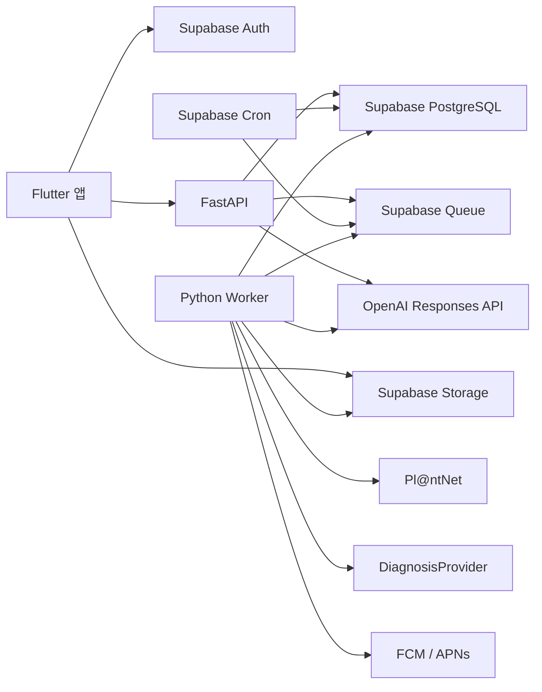
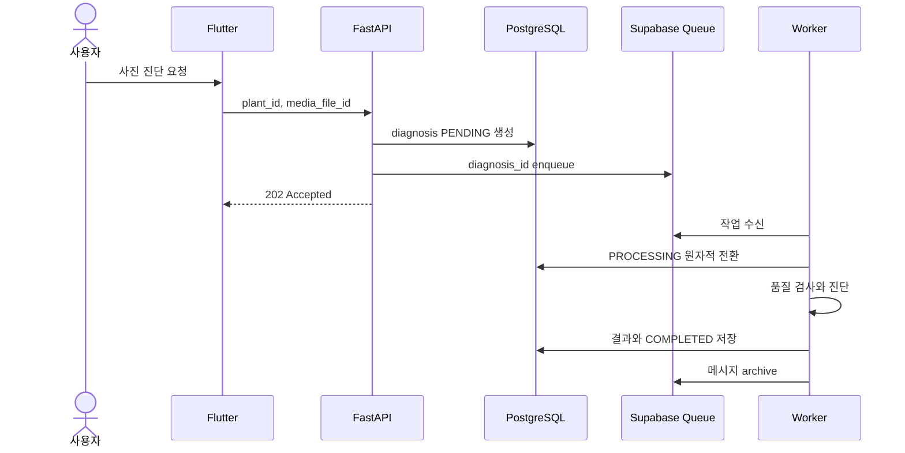

# 시스템 아키텍처

## 1. 결정 사항

- Flutter 앱, FastAPI API, Python Worker를 한 저장소에서 관리합니다.
- 인증, PostgreSQL, Storage, Queue, Cron은 Supabase를 사용합니다.
- API와 Worker는 같은 Python 패키지를 사용하지만 별도 프로세스로 배포합니다.
- Docker는 필수가 아니며 배포 환경에서 필요할 때만 추가합니다.
- 식물명칭 사진 인식은 Pl@ntNet, 상태 진단은 교체 가능한 `DiagnosisProvider`를
  사용합니다.
- 실시간 AI 상담은 OpenAI Responses API와 Tool Calling을 사용합니다.
- OpenAI Batch API와 월간 AI 리포트는 현재 MVP에 포함하지 않습니다.

## 2. 전체 구조



FastAPI는 인증, 소유권, 입력 검증과 짧은 트랜잭션을 담당합니다. 외부 API 호출,
사진 분석, 푸시 발송과 파일 삭제처럼 오래 걸리는 작업은 Queue와 Worker가 담당합니다.

## 3. 인증

지원 방식:

- 인증 링크가 필요한 이메일·비밀번호
- Naver Custom OAuth2
- Kakao OAuth
- Apple OAuth

Google 로그인은 지원하지 않습니다. 이메일 가입의 닉네임은 Supabase 사용자 메타데이터
`leafie_nickname`으로 전달합니다. OAuth 최초 로그인은 프로필의
`profile_completed_at`이 null이면 앱에서 닉네임 입력 화면을 거칩니다.

비밀번호 찾기와 변경은 Supabase가 이메일 링크를 발송하고, 링크가 앱 딥링크로 돌아온
뒤 앱에서 새 비밀번호를 입력하는 방식입니다. FastAPI는 비밀번호를 받거나 저장하지
않습니다.

App Store 출시 전 확인 항목:

- Apple 로그인 실기기 검증
- Apple 비공개 릴레이 이메일 처리
- OAuth 딥링크와 취소·실패 화면
- 운영 SMTP와 인증·재설정 링크 만료
- 회원 탈퇴와 최근 재인증

## 4. 저장소와 이미지

- Storage 버킷 `leafie-media`는 비공개입니다.
- 앱은 FastAPI에서 Signed Upload URL을 받은 뒤 Storage에 직접 업로드합니다.
- 업로드 완료 후 FastAPI가 크기, 형식, 소유권과 용도를 검증합니다.
- 조회 시 짧게 만료되는 Signed Download URL을 발급합니다.
- EXIF 위치 정보는 제거합니다.
- 등록 인식 사진은 같은 `media_file_id`를 식물 대표 사진으로 재사용합니다.
- 다이어리 사진은 최대 한 장, 진단 사진은 정확히 한 장입니다.
- 지원 형식은 JPEG와 PNG이며 HEIC는 앱에서 JPEG로 변환합니다.

## 5. Queue와 Worker



Queue payload에는 `job_type`, `resource_id`, 추적 ID만 넣습니다. 원본 사진, 사용자
대화와 API Key는 넣지 않습니다. Worker는 DB에서 최신 상태를 다시 읽습니다.

Worker 작업:

- Pl@ntNet 식물명칭 사진 인식
- 사진 상태 진단
- 채팅 사진 처리
- 푸시 발송
- Storage 및 계정 삭제

작업은 리소스 ID를 멱등성 키로 사용합니다. 일시 오류는 지수 backoff로 재시도하고,
영구 오류나 최대 재시도 초과는 실패 코드를 저장한 뒤 메시지를 archive합니다.

## 6. 식물 등록

```text
애칭 입력
→ 지원 23종 검색 또는 사진 한 장 인식
→ 후보 확인
→ 함께한 시작일과 환경 입력
→ 마지막 물주기·분갈이 정보로 최초 일정 계산
→ 성격 선택
→ 컬러·헤어·장식 선택
→ 식물, 일정, 첫 대화 세션을 트랜잭션으로 생성
```

사진 인식 후보는 Pl@ntNet 결과를 GBIF ID 우선, 학명 차순으로 내부 23종과 매칭합니다.
대분류 7개는 사용자가 선택하지 않고 선택한 종에서 파생합니다. 등록 중 임시저장은
Flutter 로컬 저장소에서 처리하며 서버 초안 테이블을 만들지 않습니다.

## 7. 관리 일정

- 자동 반복은 물주기와 분갈이만 지원합니다.
- 비료와 가지치기는 사용자 또는 AI 추천으로 만드는 일회성 일정입니다.
- 홈의 자유 할 일도 일회성 `CUSTOM` 이벤트입니다.
- 홈 메모는 완료할 수 없는 날짜별 메모이며 관리 이벤트와 분리합니다.

관리 완료에는 두 시각을 구분합니다.

- `performed_on`: 사용자가 실제로 관리한 날짜
- `recorded_at`: 서버가 완료 요청을 받은 시각

오늘 완료는 서버의 사용자 시간대 날짜를 `performed_on`으로 사용합니다. 체크를 잊은
경우 과거 날짜를 선택할 수 있지만 미래 날짜는 허용하지 않습니다. 다음 물주기와
분갈이 날짜는 `performed_on + interval_days`로 계산합니다.

`TODAY`와 `OVERDUE`는 DB 상태로 반복 저장하지 않고 `due_date`와 사용자 시간대의
오늘을 비교해 계산합니다. Cron은 알림 대상 수집에 사용하고 일정 날짜를 임의로
밀지 않습니다.

## 8. 홈·캘린더·다이어리

- `user_profiles.selected_plant_id`가 홈, 캘린더, 다이어리와 AI의 기본 식물입니다.
- 홈은 선택 식물의 오늘 일정만 보여줍니다.
- 상세 화면은 지연, 오늘, 미래 일정만 보여주며 완료 이력은 캘린더에서 봅니다.
- 홈 대사는 성격, 오늘 컨디션과 일정 상태에 맞는 고정 문구 중 하나를 선택합니다.
- 다이어리는 식물별 하루 한 개이며 글과 0~100 컨디션은 필수, 사진은 선택입니다.
- 과거 다이어리는 작성할 수 있고 미래는 불가하며 작성 후 수정만 가능합니다.
- 월별 컨디션은 해당 월 점수 평균을 SQL로 계산합니다.

컨디션 5단계:

```text
0~20=1, 21~40=2, 41~60=3, 61~80=4, 81~100=5
```

## 9. AI 채팅과 Tool Calling

식물별 영구 채팅방은 제품 개념이고 DB에서는 `ai_conversations.plant_id`로 직접
표현합니다. `새 채팅`은 같은 식물에 새 대화 세션을 만듭니다. 모델 입력은 해당
세션의 최근 메시지와 누적 요약으로 제한합니다.

읽기 Tool 예시:

- 식물 기본 정보
- 종별 관리 가이드
- 환경
- 오늘 및 예정 일정
- 최근 관리 이력
- 최근 다이어리 컨디션
- 최근 진단

`user_id`와 `plant_id`는 모델 인자를 신뢰하지 않고 서버가 주입합니다. Tool 인자는
Pydantic으로 검증하며 호출 결과는 최소 감사 정보만 저장합니다.

AI가 비료나 가지치기 일정을 제안하면 `AI_ACTIONS`를 생성합니다. 사용자 승인 전에는
업무 데이터를 변경하지 않습니다. 물주기·분갈이 반복 주기는 AI가 변경하지 않습니다.

## 10. 사진 진단

진단 입력:

- 사진 정확히 한 장
- 식물 종과 환경
- 최근 물주기·분갈이 이력
- 내부 종별 관리·진단 가이드

일반 채팅 전체는 진단 모델 입력으로 사용하지 않습니다. 대화 ID는 진단을 시작한
화면으로 돌아가기 위한 연결 정보입니다.

진단 단계:

1. 식물 존재, 흐림, 밝기와 증상 부위 노출 검사
2. `DiagnosisProvider` 호출
3. Provider 응답을 내부 schema로 표준화
4. 내부 관리 규칙으로 추천 관리 생성
5. LLM이 한국어 설명만 생성
6. 채팅 결과 카드, 진단 이력과 푸시 알림 생성

진단표는 사진, 진단 일자, 상태 문구, 관찰 증상, 원인 TOP 3와 추천 관리만 표시합니다.
건강점수, 단일 AI 신뢰도와 진단 점수 그래프는 만들지 않습니다. 원인 확률은 전문
Provider가 반환한 값만 사용합니다.

## 11. 알림

- FCM/APNs 앱 푸시만 지원합니다.
- 이메일과 SMS 관리 알림은 보내지 않습니다.
- 전체 푸시 ON/OFF는 `user_profiles.push_enabled` 한 값으로 관리합니다.
- 앱 내 알림함은 모든 식물의 발송 이력과 읽음 상태를 보여줍니다.
- 기기별 토큰은 `device_tokens`에서 관리하고 로그아웃 또는 권한 철회 시 폐기합니다.

## 12. 배포와 운영

배포 프로세스:

```text
API: uvicorn app.main:app
Worker: python -m app.worker
```

필수 운영 항목:

- API와 Worker의 health check
- 요청·작업 추적 ID
- 외부 Provider 지연 시간, 오류율과 비용
- Queue 적체량과 재시도 횟수
- DB 백업과 Alembic migration
- 비밀값 환경변수 관리
- 사용자별 rate limit

## 13. 역할

- 백엔드 A: Auth, 사용자, 식물·캐릭터, 다이어리, 관리 일정, 홈·캘린더
- 백엔드 B: Storage, Queue·Worker, 식물 인식, 진단, AI 채팅, Tool Calling, 푸시 발송
- 공통: ERD, API 계약, migration, RLS, CI와 배포 설정
