# ERD 및 데이터 정책

## 1. ERD

Supabase의 `auth.users`, Storage, Queues 내부 테이블은 Supabase가 관리합니다.
아래 ERD에는 애플리케이션이 직접 소유하는 업무 테이블과 필요한 참조만 표시합니다.

```mermaid
erDiagram
    AUTH_USERS ||--|| USER_PROFILES : extends
    AUTH_USERS ||--o{ MEDIA_FILES : uploads
    AUTH_USERS ||--o{ SPECIES_IDENTIFICATIONS : requests
    AUTH_USERS ||--o{ PLANTS : owns
    AUTH_USERS ||--o{ AI_CHATS : owns
    AUTH_USERS ||--o{ AI_ACTIONS : approves
    AUTH_USERS ||--o{ NOTIFICATIONS : receives
    AUTH_USERS ||--|| NOTIFICATION_SETTINGS : configures
    AUTH_USERS ||--o{ DEVICE_TOKENS : registers

    MEDIA_FILES ||--o{ USER_PROFILES : profile_image
    MEDIA_FILES ||--o{ PLANTS : profile_image
    MEDIA_FILES ||--o{ SPECIES_IDENTIFICATIONS : identification_image
    MEDIA_FILES ||--o{ PLANT_DIARIES : diary_image
    MEDIA_FILES ||--o{ DIAGNOSIS_IMAGES : diagnosis_image
    MEDIA_FILES ||--o{ AI_MESSAGES : chat_attachment

    SPECIES_CARE_GUIDES o|--o{ PLANTS : guides
    PLANTS ||--|| PLANT_CHARACTERS : has
    PLANTS ||--|| PLANT_ENVIRONMENTS : has
    PLANTS ||--o{ PLANT_DIARIES : has
    PLANTS ||--o{ CARE_SCHEDULES : configures
    PLANTS ||--o{ CARE_EVENTS : records
    PLANTS ||--o{ DIAGNOSES : receives
    PLANTS ||--|| AI_CHATS : has_chat
    PLANTS ||--o{ AI_ACTIONS : affected_by
    PLANTS ||--o{ AI_BATCH_ITEMS : batched_for
    PLANTS ||--o{ MONTHLY_REPORTS : summarized_by
    PLANTS ||--o{ NOTIFICATIONS : concerns

    SPECIES_IDENTIFICATIONS o|--o| PLANTS : selected_for

    CARE_SCHEDULES o|--o{ CARE_EVENTS : generates
    DIAGNOSES o|--o{ CARE_EVENTS : recommends
    DIAGNOSES ||--|| DIAGNOSIS_IMAGES : analyzes
    DIAGNOSES ||--o{ AI_MESSAGES : referenced_by
    AI_CONVERSATIONS o|--o{ DIAGNOSES : creates

    AI_CHATS ||--o{ AI_CONVERSATIONS : contains
    AI_CONVERSATIONS ||--o{ AI_MESSAGES : contains
    AI_MESSAGES ||--o{ AI_TOOL_CALLS : invokes
    AI_MESSAGES ||--o{ AI_ACTIONS : proposes

    AI_BATCH_JOBS ||--o{ AI_BATCH_ITEMS : contains
    AI_BATCH_ITEMS o|--o| MONTHLY_REPORTS : produces

    AUTH_USERS {
        uuid id PK
        varchar email UK
        timestamptz email_confirmed_at
        timestamptz created_at
    }

    USER_PROFILES {
        uuid user_id PK,FK
        uuid profile_media_file_id FK
        varchar nickname
        text bio
        varchar timezone
        uuid selected_plant_id FK
        timestamptz created_at
        timestamptz updated_at
        timestamptz deleted_at
    }

    MEDIA_FILES {
        uuid id PK
        uuid user_id FK
        varchar purpose
        varchar status
        varchar bucket_name
        varchar object_path UK
        varchar content_type
        bigint size_bytes
        varchar checksum_sha256
        int width
        int height
        timestamptz created_at
        timestamptz deleted_at
    }

    SPECIES_IDENTIFICATIONS {
        uuid id PK
        uuid user_id FK
        uuid media_file_id FK
        varchar status
        varchar provider
        jsonb candidates
        varchar failure_code
        timestamptz created_at
        timestamptz completed_at
    }

    SPECIES_CARE_GUIDES {
        varchar species_reference_id PK
        varchar display_name
        varchar scientific_name
        varchar plantnet_species_id
        bigint gbif_id
        varchar powo_id
        jsonb aliases
        varchar taxon_rank
        varchar genus
        varchar family
        varchar category
        int recommended_water_min_ml
        int recommended_water_max_ml
        int default_watering_interval_days
        int default_repotting_interval_days
        jsonb care_profile
        jsonb diagnosis_profile
        jsonb source_references
        varchar care_data_version
        date care_data_reviewed_at
        varchar water_recommendation_source
        boolean active
        timestamptz updated_at
    }

    PLANTS {
        uuid id PK
        uuid user_id FK
        uuid primary_media_file_id FK
        uuid species_identification_id FK
        varchar name
        varchar category
        varchar species_name
        varchar species_scientific_name
        varchar species_reference_id
        varchar species_selection_method
        date started_on
        text memo
        timestamptz created_at
        timestamptz updated_at
        timestamptz deleted_at
    }

    PLANT_CHARACTERS {
        uuid plant_id PK,FK
        varchar base_type
        varchar body_color
        varchar head_item
        varchar accessory
        varchar personality_type
        timestamptz updated_at
    }

    PLANT_ENVIRONMENTS {
        uuid plant_id PK,FK
        varchar place_name
        varchar pot_type
        varchar placement
        timestamptz updated_at
    }

    PLANT_DIARIES {
        uuid id PK
        uuid plant_id FK
        uuid media_file_id FK
        date diary_date
        text content
        varchar condition_level
        int condition_score
        timestamptz created_at
        timestamptz updated_at
        timestamptz deleted_at
    }

    CARE_SCHEDULES {
        uuid id PK
        uuid plant_id FK
        varchar type
        int interval_days
        date next_due_date
        int recommended_water_min_ml
        int recommended_water_max_ml
        varchar water_recommendation_source
        boolean enabled
        timestamptz created_at
        timestamptz updated_at
    }

    CARE_EVENTS {
        uuid id PK
        uuid plant_id FK
        uuid schedule_id FK
        uuid source_diagnosis_id FK
        varchar type
        varchar title
        varchar status
        timestamptz scheduled_at
        timestamptz completed_at
        text note
        timestamptz created_at
        timestamptz updated_at
    }

    DIAGNOSES {
        uuid id PK
        uuid plant_id FK
        uuid related_conversation_id FK
        varchar status
        varchar overall_condition
        date symptom_started_on
        jsonb input_context_snapshot
        jsonb image_quality_result
        text user_note
        text condition_label
        jsonb observations
        jsonb possible_causes
        jsonb recommended_care
        varchar retake_reason_code
        varchar failure_code
        varchar diagnosis_provider
        varchar diagnosis_model_name
        varchar diagnosis_provider_response_id
        varchar explanation_provider
        varchar explanation_model_name
        varchar explanation_prompt_version
        varchar care_rule_version
        int diagnosis_latency_ms
        numeric estimated_cost
        varchar cost_currency
        timestamptz created_at
        timestamptz started_at
        timestamptz completed_at
        timestamptz deleted_at
    }

    DIAGNOSIS_IMAGES {
        uuid diagnosis_id PK,FK
        uuid media_file_id FK
    }

    AI_CHATS {
        uuid id PK
        uuid user_id FK
        uuid plant_id FK,UK
        timestamptz created_at
        timestamptz updated_at
        timestamptz deleted_at
    }

    AI_CONVERSATIONS {
        uuid id PK
        uuid chat_id FK
        varchar title
        varchar provider_conversation_id
        text context_summary
        uuid summarized_through_message_id FK
        varchar summary_version
        timestamptz summary_updated_at
        timestamptz last_message_at
        timestamptz created_at
        timestamptz updated_at
        timestamptz deleted_at
    }

    AI_MESSAGES {
        uuid id PK
        uuid conversation_id FK
        uuid related_diagnosis_id FK
        uuid media_file_id FK
        varchar role
        varchar status
        text content
        varchar provider
        varchar model_name
        varchar provider_response_id
        int input_tokens
        int output_tokens
        timestamptz created_at
    }

    AI_TOOL_CALLS {
        uuid id PK
        uuid message_id FK
        varchar provider_call_id UK
        varchar tool_name
        jsonb arguments
        jsonb result_summary
        varchar status
        int latency_ms
        varchar error_code
        timestamptz created_at
        timestamptz completed_at
    }

    AI_ACTIONS {
        uuid id PK
        uuid user_id FK
        uuid message_id FK
        uuid plant_id FK
        varchar action_type
        jsonb payload
        varchar status
        int version
        timestamptz expires_at
        timestamptz confirmed_at
        timestamptz executed_at
        timestamptz created_at
    }

    AI_BATCH_JOBS {
        uuid id PK
        varchar job_type
        varchar provider_batch_id UK
        varchar status
        varchar input_file_id
        varchar output_file_id
        int total_count
        int completed_count
        int failed_count
        varchar error_code
        timestamptz submitted_at
        timestamptz completed_at
        timestamptz created_at
    }

    AI_BATCH_ITEMS {
        uuid id PK
        uuid batch_job_id FK
        varchar custom_id UK
        uuid plant_id FK
        int target_year
        int target_month
        varchar status
        jsonb result
        varchar error_code
        timestamptz created_at
        timestamptz completed_at
    }

    MONTHLY_REPORTS {
        uuid id PK
        uuid plant_id FK
        uuid batch_item_id FK
        int report_year
        int report_month
        varchar status
        numeric average_condition_score
        text condition_summary
        text care_summary
        jsonb frequent_issues
        jsonb next_month_recommendations
        varchar model_name
        varchar prompt_version
        timestamptz generated_at
        timestamptz created_at
        timestamptz updated_at
    }

    NOTIFICATIONS {
        uuid id PK
        uuid user_id FK
        uuid plant_id FK
        varchar type
        varchar title
        text body
        varchar source_type
        uuid source_id
        timestamptz read_at
        timestamptz created_at
    }

    NOTIFICATION_SETTINGS {
        uuid user_id PK,FK
        boolean care_reminder_enabled
        boolean diagnosis_complete_enabled
        boolean monthly_report_enabled
        time quiet_hours_start
        time quiet_hours_end
        timestamptz updated_at
    }

    DEVICE_TOKENS {
        uuid id PK
        uuid user_id FK
        varchar platform
        varchar token UK
        timestamptz last_used_at
        timestamptz created_at
        timestamptz revoked_at
    }
```



## 2. 핵심 관계

- `AUTH_USERS`는 Supabase `auth.users`를 나타내며 비밀번호와 세션은 Supabase가 관리합니다.
- 이메일·Google·Kakao·Naver 로그인 identity는 Supabase `auth.identities`가
  관리하며 계정 연결 정책은 Provider별 실기기 테스트로 검증합니다.
- `USER_PROFILES.user_id`는 `auth.users.id`와 동일한 1:1 키입니다.
- 사용자는 여러 식물을 소유하고 그중 하나를 현재 캐릭터 방으로 선택합니다.
- 컨디션은 다이어리에 포함되며 홈에서는 오늘 다이어리의 값을 읽기 전용으로 표시합니다.
- 다이어리는 사진을 최대 한 장, 진단은 정확히 한 장 사용합니다.
- 식물명칭은 검색 또는 사진 인식 후보에서 선택하며 사진 인식 결과는 사용자가 확정합니다.
- 자동 반복 일정은 물주기와 분갈이만 지원합니다.
- 물 권장량은 운영팀 종별 가이드에서 물주기 규칙으로 복사하는 읽기 전용 참고값입니다.
- 사용자 자유 할 일은 `CUSTOM` 타입의 일회성 관리 이벤트입니다.
- 식물 하나에는 영구 AI 채팅방이 정확히 하나 있고 그 안에 여러 대화 세션이 있습니다.
- AI 대화 기록은 세션별로 보존하되 모델 입력은 해당 세션의 최근 메시지와 누적
  요약으로 제한합니다.
- 읽기 Tool Call은 서버가 실행하고 변경 제안은 `AI_ACTIONS`에서 사용자 승인을 기다립니다.
- OpenAI Batch 하나는 여러 항목을 포함하고 각 항목은 최대 하나의 월간 리포트를 생성합니다.
- Supabase Queues 메시지는 업무 테이블 ID만 운반하며 업무 데이터의 원본은 아닙니다.

## 3. 제약조건

| 테이블 | 제약조건 |
|---|---|
| `user_profiles` | `user_id`는 Supabase `auth.users.id`, `selected_plant_id`는 본인 소유 식물 |
| `species_identifications` | 사진 한 장, 상태 전이 검증, 완료 후보의 표시명·학명·참조 ID·신뢰도 저장 |
| `species_care_guides` | 운영팀 관리, GBIF ID 우선 매칭, 별칭 검색, 기본 일정은 양수 또는 null, 관리·진단 데이터에는 버전과 출처 저장 |
| `plants` | `category`는 확정된 7개 Enum, `name`, `species_name`, `species_reference_id`, `species_selection_method` 필수 |
| `plant_characters` | `personality_type`은 확정된 6개 Enum |
| `plant_diaries` | `(plant_id, diary_date)` unique, 글과 컨디션 필수, 사진은 null 또는 한 장 |
| `care_schedules` | `type`은 `WATERING` 또는 `REPOTTING`, `(plant_id, type)` unique |
| `care_schedules` | 물 권장량은 종별 가이드의 스냅샷이며 사용자 수정 불가 |
| `care_events` | `CUSTOM`은 `title` 필수이며 반복 스케줄과 연결하지 않음 |
| `care_events` | 완료 시각은 완료 API의 서버 현재 시각이며 사용자 수정 불가 |
| `diagnosis_images` | 진단당 정확히 한 장 |
| `diagnoses` | `overall_condition`은 `HEALTHY`, `UNHEALTHY`, `UNCERTAIN` 중 하나 |
| `diagnoses` | `possible_causes`는 최대 3개, 원인별 `confidence`는 제공자가 반환한 0~1 값 또는 null |
| `diagnoses` | 표시 필드는 진단 일자, 상태 문구, 관찰 증상, 원인 분석, 추천 관리 |
| `diagnoses` | 전체 건강점수와 LLM이 생성한 진단 확률은 저장하지 않음 |
| `diagnoses` | 진단 모델, 설명 모델·프롬프트, 관리 규칙 버전을 서로 분리해 저장 |
| `ai_chats` | `plant_id` unique·필수, 식물 등록 시 함께 생성하는 영구 채팅방 |
| `ai_conversations` | 채팅방 내부의 새 채팅 단위, 제목 검색과 soft delete 지원 |
| `ai_messages` | 첨부 사진은 null 또는 한 장 |
| `ai_actions` | `PENDING_CONFIRMATION`만 confirm/cancel 가능, 만료 후 실행 불가 |
| `ai_batch_items` | `custom_id` unique |
| `monthly_reports` | `(plant_id, report_year, report_month)` unique |
| `device_tokens` | 활성 token unique |

Tool 인자는 Pydantic schema로 검증합니다. `AI_TOOL_CALLS.arguments`와
`AI_ACTIONS.payload`에는 비밀값, 원본 이미지, 다른 사용자의 식별자를 저장하지
않습니다.

## 4. 인덱스

```text
user_profiles(selected_plant_id)
plants(user_id, deleted_at)
species_care_guides(display_name)
species_care_guides(gbif_id) UNIQUE
species_care_guides(plantnet_species_id) UNIQUE WHERE plantnet_species_id IS NOT NULL
plant_diaries(plant_id, diary_date DESC)
care_schedules(plant_id, type)
care_schedules(enabled, next_due_date)
care_events(plant_id, scheduled_at)
care_events(status, scheduled_at)
diagnoses(plant_id, created_at DESC)
diagnoses(status, created_at)
ai_chats(plant_id) UNIQUE
ai_conversations(chat_id, last_message_at DESC)
ai_conversations(chat_id, title)
ai_messages(conversation_id, created_at)
ai_tool_calls(message_id, created_at)
ai_actions(user_id, status, expires_at)
ai_batch_jobs(status, created_at)
ai_batch_items(batch_job_id, status)
monthly_reports(plant_id, report_year DESC, report_month DESC)
notifications(user_id, read_at, created_at DESC)
media_files(user_id, status, created_at)
device_tokens(user_id, revoked_at)
```

## 5. Supabase 보안

- Flutter 앱에는 publishable key만 포함합니다.
- `service_role` 키는 FastAPI와 Worker에서만 사용합니다.
- Supabase Storage 버킷은 비공개로 유지합니다.
- 사용자 알림 채널은 앱 푸시만 사용하며 SMS·이메일 발송 정보는 저장하지 않습니다.
- 앱은 업무 테이블을 직접 수정하지 않고 FastAPI를 호출합니다.
- Data API가 활성화된 업무 테이블에는 RLS를 적용해 본인 행만 접근하도록 방어합니다.
- Queue schema는 Flutter에 노출하지 않고 FastAPI, Worker, Cron만 접근합니다.
- FastAPI는 Supabase JWT 검증 후 모든 리소스의 소유권을 다시 검사합니다.

## 6. 삭제 정책

- 화면의 삭제는 우선 `deleted_at`을 기록하는 soft delete로 처리합니다.
- 계정 탈퇴 시 FastAPI가 세션의 최근 인증 여부를 확인하고 삭제 작업을 Queue에 넣습니다.
- Worker가 Supabase Storage 객체와 업무 데이터를 제거한 뒤 Auth Admin API로 사용자를 삭제합니다.
- AI 품질 개선에 사용자 사진이나 대화를 재사용하려면 별도의 명시적 동의와 철회 경로가 필요합니다.
- Tool Call 감사 로그는 개인정보를 제거한 최소 정보만 제한된 기간 동안 보관합니다.

## 7. 파생 데이터

- `days_together`: `plants.started_on`과 사용자 시간대의 오늘 날짜 차이
- `gardener_days`: Supabase `auth.users.created_at`과 오늘 날짜 차이
- `current_condition`: 오늘 다이어리의 컨디션, 없으면 `null`
- `care_event_counts`: 조회 기간 내 완료 이벤트 집계
- `monthly_condition.average_score`: 해당 월 다이어리 컨디션 평균
- `monthly_condition.level`: 평균을 5개 아이콘 구간으로 변환

컨디션은 `VERY_BAD=10`, `BAD=30`, `NORMAL=50`, `GOOD=70`,
`VERY_GOOD=90`으로 저장합니다. 기록이 없는 달은 평균을 0으로 만들지 않고
`null`로 반환합니다.
