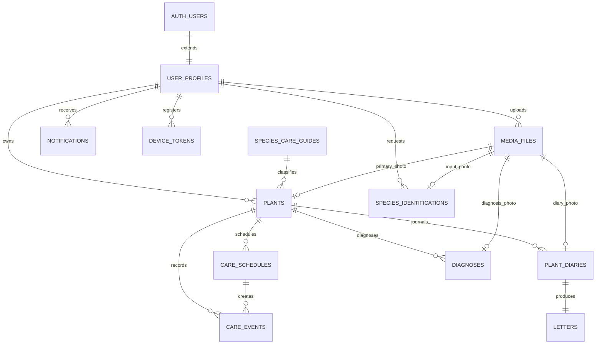

# ERD 및 데이터 정책

이 문서는 최신 제품 기준의 목표 스키마입니다. Alembic migration과 SQLAlchemy 모델은
이 계약에 맞춰 별도 구현합니다. 센서 소유 테이블은 포함하지 않습니다.

표는 변경 대상의 개념 요약입니다. 생략된 기존 컬럼을 삭제하지 않습니다. 실제 변경은
[전환 기준](product-transition.md)과 기능별 migration에서 확정합니다.

## 1. 관계



## 2. 핵심 테이블

### `user_profiles`

| 필드 | 타입 | 규칙 |
|---|---|---|
| `user_id` | uuid | PK, `auth.users.id` FK |
| `nickname` | varchar(30) | 필수 |
| `profile_completed_at` | timestamptz | OAuth 닉네임 완료 여부 |
| `selected_plant_id` | uuid | nullable, 소유 식물 FK |
| `timezone` | varchar(50) | 기본 `Asia/Seoul` |
| `notifications_enabled` | boolean | 기본 true |
| `created_at`, `updated_at` | timestamptz | 필수 |
| `deleted_at` | timestamptz | nullable |

이메일과 비밀번호는 Supabase Auth가 소유합니다. 프로필 사진과 한 줄 소개 필드는 두지
않습니다.

### `species_care_guides`

| 필드 | 타입 | 규칙 |
|---|---|---|
| `species_reference_id` | varchar | PK |
| `display_name` | varchar | 필수 |
| `scientific_name`, `family_name` | varchar | 필수 |
| `gbif_id`, `plantnet_species_id` | bigint/varchar | nullable, 인식 매핑 키 |
| `category` | varchar | 7개 내부 대분류 중 하나 |
| `flowering_period`, `care_summary` | text/jsonb | nullable |
| `default_watering_interval_days` | integer | 양수 |
| `default_repotting_interval_days` | integer | 양수 |
| `active` | boolean | 기본 true |

사용자가 선택하는 값은 이 테이블의 정확한 23종이며 `category`는 파생 정보입니다.

### `plants`

| 필드 | 타입 | 규칙 |
|---|---|---|
| `id` | uuid | PK |
| `user_id` | uuid | 소유자 FK |
| `species_reference_id` | varchar | 지원 종 FK |
| `nickname` | varchar(30) | 필수 |
| `place_name` | varchar(50) | 필수 |
| `started_on` | date | 필수, 미래 불가 |
| `personality_type` | enum | 6종 중 하나 |
| `color_id`, `hair_id` | varchar | 필수 |
| `primary_media_file_id` | uuid | nullable, 소유 미디어 FK |
| `client_registration_id` | uuid | 사용자별 멱등 키 |
| `registration_request_hash` | varchar | 멱등 요청 검증 |
| `created_at`, `updated_at` | timestamptz | 필수 |
| `deleted_at` | timestamptz | nullable |

`(user_id, client_registration_id)`는 unique입니다. 컨디션, 화분, 위치 분류와 장식 필드는
두지 않습니다.

### `plant_diaries`

| 필드 | 타입 | 규칙 |
|---|---|---|
| `id` | uuid | PK |
| `plant_id` | uuid | 소유 식물 FK |
| `diary_date` | date | 미래 불가 |
| `weather` | enum | 필수 |
| `title` | varchar(80) | 필수 |
| `content` | varchar(2000) | 필수 |
| `media_file_id` | uuid | nullable, 최대 한 장 |
| `created_at`, `updated_at` | timestamptz | 필수 |

`(plant_id, diary_date)`는 unique입니다. 컨디션 점수는 저장하지 않습니다.

### `letters`

| 필드 | 타입 | 규칙 |
|---|---|---|
| `id` | uuid | PK |
| `plant_id` | uuid | 소유 식물 FK |
| `diary_id` | uuid | unique, 다이어리 FK |
| `status` | enum | `PENDING` 기본 |
| `content` | text | 완료 전 nullable |
| `scheduled_at` | timestamptz | 다이어리 생성 후 5~15분 |
| `started_at`, `generated_at` | timestamptz | nullable |
| `read_at` | timestamptz | nullable |
| `provider`, `model` | varchar | nullable |
| `input_tokens`, `output_tokens` | integer | nullable |
| `retry_count` | integer | 기본 0 |
| `failure_code` | varchar | nullable |
| `created_at`, `updated_at` | timestamptz | 필수 |
| `deleted_at` | timestamptz | nullable |

`diary_id` unique로 다이어리당 편지 한 통을 보장합니다. `COMPLETED` 편지의 `content`,
`generated_at`, `provider`, `model`은 변경하지 않습니다. 다이어리 수정은 완료된 편지를
갱신하거나 새 편지를 만들지 않습니다.

### `care_schedules`

| 필드 | 타입 | 규칙 |
|---|---|---|
| `id` | uuid | PK |
| `plant_id` | uuid | FK |
| `care_type` | enum | `WATERING` 또는 `REPOTTING` |
| `interval_days` | integer | 양수 |
| `next_due_date` | date | 필수 |
| `enabled` | boolean | 기본 true |
| `created_at`, `updated_at` | timestamptz | 필수 |

활성 반복 규칙은 `(plant_id, care_type)`당 최대 한 개입니다.

### `care_events`

| 필드 | 타입 | 규칙 |
|---|---|---|
| `id` | uuid | PK |
| `plant_id` | uuid | FK |
| `schedule_id` | uuid | 일회성이면 nullable |
| `care_type` | enum | 3종 중 하나 |
| `due_date` | date | 필수 |
| `status` | enum | `SCHEDULED` 또는 `COMPLETED` |
| `performed_on` | date | 완료 전 nullable |
| `recorded_at` | timestamptz | 완료 전 nullable |
| `client_event_id` | uuid | 일회성 생성 멱등 키, nullable |
| `created_at`, `updated_at` | timestamptz | 필수 |

`TODAY`와 `OVERDUE`는 저장 상태가 아닙니다. `PRUNING`, `CONDITION`, `CUSTOM` 이벤트는
사용하지 않습니다.

### `diagnoses`

| 필드 | 타입 | 규칙 |
|---|---|---|
| `id` | uuid | PK |
| `plant_id` | uuid | FK |
| `media_file_id` | uuid | FK, 사진 한 장 |
| `status` | enum | 비동기 상태 |
| `overall_condition`, `condition_label` | varchar/text | 완료 전 nullable |
| `observations`, `possible_causes`, `recommended_care` | jsonb | 완료 전 nullable |
| `diagnosis_provider`, `provider_response_id` | varchar | nullable |
| `retry_count`, `failure_code` | integer/varchar | 재시도 정보 |
| `created_at`, `started_at`, `completed_at` | timestamptz | 상태별 시각 |

대화 연결 필드는 두지 않습니다. Provider 원본 전체를 영구 저장하지 않고 정규화 결과와
추적에 필요한 최소 정보만 보관합니다.

### 기타 공통 테이블

- `media_files`: 소유자, Storage key, 용도, MIME, 크기, 완료·삭제 상태를 저장합니다.
- `species_identifications`: 입력 사진, 비동기 상태, 순서가 있는 지원 종 후보를 저장합니다.
- `notifications`: 사용자, 종류, 제목·본문, 대상 화면과 리소스 ID, `read_at`을 저장합니다.
- `device_tokens`: 기존 푸시 설치 정보 테이블을 유지합니다.
- Queue 발행은 기존 DB 트랜잭션 연동을 재사용합니다. 별도 outbox 테이블 추가는
  기존 구조로 원자성을 보장할 수 없는 경우에만 검토합니다.

센서 장치와 측정값 테이블은 센서 담당 스키마에 둡니다. `device_tokens`는 푸시 수신 설치
정보이며 센서 장치가 아닙니다.

## 3. Enum

```text
PersonalityType = OUTGOING | CHIC | CUTE | CRUSH | INTROVERTED | CHUNGCHEONG
DiaryWeather = SUNNY | PARTLY_CLOUDY | CLOUDY | RAINY | SNOWY
CareType = WATERING | REPOTTING | FERTILIZING
CareEventStatus = SCHEDULED | COMPLETED
AsyncStatus = PENDING | PROCESSING | COMPLETED | FAILED
DiagnosisStatus = PENDING | PROCESSING | COMPLETED | NEEDS_RETAKE | FAILED | CANCELLED
DiagnosisCondition = HEALTHY | UNHEALTHY | UNCERTAIN
LetterStatus = PENDING | PROCESSING | COMPLETED | FAILED
MediaPurpose = PLANT_PROFILE | SPECIES_IDENTIFICATION | DIARY | DIAGNOSIS
```

## 4. 핵심 제약과 인덱스

- 모든 사용자 데이터는 RLS와 서비스 계층 소유권 검사를 함께 적용합니다.
- `plants(user_id, client_registration_id)` unique
- `plant_diaries(plant_id, diary_date)` unique
- `letters(diary_id)` unique
- 활성 `care_schedules(plant_id, care_type)` partial unique
- `care_events(plant_id, due_date, status)` index
- `letters(status, scheduled_at)` index
- `notifications(user_id, read_at, created_at desc)` index
- `diagnoses(plant_id, created_at desc)` index
- 사용자 입력 날짜는 사용자 시간대로 해석하고 저장 시 date 또는 UTC timestamptz를 구분합니다.

## 5. 삭제 정책

- 식물 삭제는 관련 일정, 다이어리, 편지, 진단과 연결 알림을 더 이상 노출하지 않게 합니다.
- 다이어리 사진, 대표 사진과 진단 사진의 실제 Storage 삭제는 Queue 작업으로 처리합니다.
- 편지 삭제는 우편함에서의 soft delete이며 원본 다이어리는 유지합니다.
- 회원 탈퇴는 JWT 사용 차단을 우선하고 데이터·Storage 삭제는 멱등 Worker로 마무리합니다.

## 6. 제거된 구조

다음 구조는 최신 제품 범위에 포함하지 않습니다.

- `ai_conversations`, `ai_messages`, `ai_tool_calls`, `ai_actions`
- `plant_daily_memos`
- 다이어리 컨디션 점수와 월별 컨디션 통계
- 가지치기와 자유 할 일 이벤트
- 장식, 화분 재질, 위치 분류
- 진단과 채팅 연결
- 센서 원시 데이터와 판정 로직
