# ERD 및 데이터 정책

이 문서는 확정된 와이어프레임에 필요한 MVP 데이터만 정의합니다. Supabase의
`auth.users`, Storage, Queues 내부 테이블은 Supabase가 관리하므로 애플리케이션
테이블로 다시 만들지 않습니다.

## 1. ERD

```mermaid
erDiagram
    AUTH_USERS ||--|| USER_PROFILES : extends
    AUTH_USERS ||--o{ MEDIA_FILES : uploads
    AUTH_USERS ||--o{ SPECIES_IDENTIFICATIONS : requests
    AUTH_USERS ||--o{ PLANTS : owns
    AUTH_USERS ||--o{ NOTIFICATIONS : receives
    AUTH_USERS ||--o{ DEVICE_TOKENS : registers

    MEDIA_FILES ||--o{ SPECIES_IDENTIFICATIONS : identifies
    MEDIA_FILES ||--o{ PLANTS : primary_photo
    MEDIA_FILES ||--o{ PLANT_DIARIES : diary_photo
    MEDIA_FILES ||--o{ DIAGNOSES : diagnosis_photo
    MEDIA_FILES ||--o{ AI_MESSAGES : chat_attachment

    SPECIES_CARE_GUIDES ||--o{ PLANTS : classifies
    SPECIES_IDENTIFICATIONS o|--o| PLANTS : selected_for

    PLANTS ||--o{ PLANT_DAILY_MEMOS : has
    PLANTS ||--o{ PLANT_DIARIES : has
    PLANTS ||--o{ CARE_SCHEDULES : schedules
    PLANTS ||--o{ CARE_EVENTS : records
    PLANTS ||--o{ DIAGNOSES : receives
    PLANTS ||--o{ AI_CONVERSATIONS : chats_about
    PLANTS ||--o{ AI_ACTIONS : affected_by
    PLANTS ||--o{ NOTIFICATIONS : concerns

    CARE_SCHEDULES o|--o{ CARE_EVENTS : generates
    DIAGNOSES o|--o{ CARE_EVENTS : recommends
    AI_CONVERSATIONS o|--o{ DIAGNOSES : starts
    AI_CONVERSATIONS ||--o{ AI_MESSAGES : contains
    AI_MESSAGES ||--o{ AI_TOOL_CALLS : invokes
    AI_MESSAGES ||--o{ AI_ACTIONS : proposes

    AUTH_USERS {
        uuid id PK
        varchar email UK
        timestamptz email_confirmed_at
        timestamptz created_at
    }

    USER_PROFILES {
        uuid user_id PK,FK
        varchar nickname
        varchar timezone
        uuid selected_plant_id FK
        boolean push_enabled
        timestamptz profile_completed_at
        varchar deletion_status
        timestamptz created_at
        timestamptz updated_at
        timestamptz deleted_at
    }

    MEDIA_FILES {
        uuid id PK
        uuid user_id FK
        varchar purpose
        varchar status
        varchar bucket_name
        varchar object_path UK
        varchar content_type
        bigint size_bytes
        varchar checksum_sha256
        int width
        int height
        timestamptz created_at
        timestamptz deleted_at
    }

    SPECIES_IDENTIFICATIONS {
        uuid id PK
        uuid user_id FK
        uuid media_file_id FK,UK
        varchar status
        varchar provider
        jsonb candidates
        varchar failure_code
        timestamptz created_at
        timestamptz completed_at
    }

    SPECIES_CARE_GUIDES {
        varchar species_reference_id PK
        varchar display_name
        varchar scientific_name
        varchar plantnet_species_id
        bigint gbif_id
        jsonb aliases
        varchar family_name
        varchar flowering_period
        varchar category
        int recommended_water_min_ml
        int recommended_water_max_ml
        int default_watering_interval_days
        int default_repotting_interval_days
        jsonb care_profile
        jsonb diagnosis_profile
        jsonb source_references
        varchar data_version
        date reviewed_at
        boolean active
        timestamptz updated_at
    }

    PLANTS {
        uuid id PK
        uuid user_id FK
        varchar species_reference_id FK
        uuid species_identification_id FK
        uuid primary_media_file_id FK
        varchar nickname
        varchar species_selection_method
        date started_on
        varchar place_name
        varchar pot_type
        varchar placement
        varchar personality_type
        varchar color_id
        varchar hair_id
        varchar accessory_id
        timestamptz created_at
        timestamptz updated_at
        timestamptz deleted_at
    }

    PLANT_DAILY_MEMOS {
        uuid id PK
        uuid plant_id FK
        date memo_date
        text content
        timestamptz created_at
        timestamptz updated_at
    }

    PLANT_DIARIES {
        uuid id PK
        uuid plant_id FK
        uuid media_file_id FK
        date diary_date
        text content
        int condition_score
        timestamptz created_at
        timestamptz updated_at
    }

    CARE_SCHEDULES {
        uuid id PK
        uuid plant_id FK
        varchar type
        int interval_days
        date next_due_date
        int recommended_water_min_ml
        int recommended_water_max_ml
        varchar recommendation_source
        boolean enabled
        timestamptz created_at
        timestamptz updated_at
    }

    CARE_EVENTS {
        uuid id PK
        uuid plant_id FK
        uuid schedule_id FK
        uuid source_diagnosis_id FK
        varchar type
        varchar title
        varchar status
        varchar source
        date due_date
        date performed_on
        timestamptz recorded_at
        timestamptz created_at
        timestamptz updated_at
    }

    DIAGNOSES {
        uuid id PK
        uuid plant_id FK
        uuid related_conversation_id FK
        uuid media_file_id FK
        varchar status
        varchar overall_condition
        jsonb input_context_snapshot
        jsonb image_quality_result
        text condition_label
        jsonb observations
        jsonb possible_causes
        jsonb recommended_care
        varchar retake_reason_code
        varchar failure_code
        varchar diagnosis_provider
        varchar diagnosis_model_name
        varchar provider_response_id
        varchar explanation_model_name
        varchar explanation_prompt_version
        varchar care_rule_version
        int latency_ms
        numeric estimated_cost
        varchar cost_currency
        timestamptz created_at
        timestamptz started_at
        timestamptz completed_at
    }

    AI_CONVERSATIONS {
        uuid id PK
        uuid plant_id FK
        varchar title
        text context_summary
        uuid summarized_through_message_id FK
        varchar summary_version
        timestamptz summary_updated_at
        timestamptz last_message_at
        timestamptz created_at
        timestamptz updated_at
        timestamptz deleted_at
    }

    AI_MESSAGES {
        uuid id PK
        uuid conversation_id FK
        uuid related_diagnosis_id FK
        uuid media_file_id FK
        varchar role
        varchar status
        text content
        varchar provider
        varchar model_name
        varchar provider_response_id
        int input_tokens
        int output_tokens
        timestamptz created_at
    }

    AI_TOOL_CALLS {
        uuid id PK
        uuid message_id FK
        varchar provider_call_id UK
        varchar tool_name
        jsonb arguments
        jsonb result_summary
        varchar status
        int latency_ms
        varchar error_code
        timestamptz created_at
        timestamptz completed_at
    }

    AI_ACTIONS {
        uuid id PK
        uuid user_id FK
        uuid message_id FK
        uuid plant_id FK
        varchar action_type
        jsonb payload
        varchar status
        timestamptz expires_at
        timestamptz confirmed_at
        timestamptz executed_at
        timestamptz created_at
    }

    NOTIFICATIONS {
        uuid id PK
        uuid user_id FK
        uuid plant_id FK
        varchar type
        varchar title
        text body
        varchar source_type
        uuid source_id
        timestamptz read_at
        timestamptz created_at
    }

    DEVICE_TOKENS {
        uuid id PK
        uuid user_id FK
        varchar platform
        varchar token UK
        timestamptz last_used_at
        timestamptz created_at
        timestamptz revoked_at
    }
```



## 2. 모델 원칙

- `USER_PROFILES`에는 닉네임과 앱 설정만 저장합니다. 이메일, 비밀번호, 로그인
  Provider는 Supabase Auth가 관리합니다.
- 프로필 사진과 한 줄 소개는 제품에 없으므로 관련 필드를 저장하지 않습니다.
- 식물은 지원하는 23종 중 하나를 반드시 참조합니다. 7개 대분류와 식물명은
  `SPECIES_CARE_GUIDES`에서 파생하며 `PLANTS`에 중복 저장하지 않습니다.
- 캐릭터와 환경은 식물과 항상 함께 존재하고 필드 수도 적으므로 별도 1:1 테이블을
  두지 않고 `PLANTS`에 포함합니다.
- 식물 등록 임시저장은 Flutter 로컬 저장소가 담당하며 서버 초안 테이블을 만들지 않습니다.
- 홈 메모는 완료 상태가 없는 식물별 하루 한 개의 기록입니다. 관리 이벤트나
  다이어리에 섞지 않습니다.
- 컨디션 단계는 `condition_score`에서 계산하며 중복 저장하지 않습니다.
- MVP에서 물주기만 `CARE_SCHEDULES`로 반복합니다. 분갈이는 알려진 마지막 날짜를
  `CARE_EVENTS` 완료 이력으로만 저장하며, 비료, 가지치기, 자유 할 일도
  `CARE_EVENTS`의 일회성 이벤트입니다.
- 식물별 영구 채팅방은 제품 개념입니다. 데이터베이스에서는 값이 없는 `AI_CHATS`
  테이블을 만들지 않고 `AI_CONVERSATIONS.plant_id`로 직접 연결합니다.
- 진단은 사진을 정확히 한 장 사용하므로 연결 테이블 없이
  `DIAGNOSES.media_file_id`에 직접 저장합니다.
- 앱 푸시 설정은 전체 ON/OFF 하나뿐이므로 `USER_PROFILES.push_enabled`에 저장합니다.
- 월간 컨디션 통계는 다이어리 점수를 조회 시 집계합니다. 별도 통계·월간 AI 리포트
  테이블을 만들지 않습니다.

## 3. 핵심 제약조건

| 테이블 | 제약조건 |
|---|---|
| `user_profiles` | `user_id`는 `auth.users.id`, `selected_plant_id`는 본인 소유 식물, `push_enabled` 기본값은 `true` |
| `user_profiles` | `deletion_status`는 null·`PENDING`·`FAILED`, OAuth 최초 로그인은 `profile_completed_at`이 null이면 닉네임 입력 필요 |
| `species_identifications` | `media_file_id` unique, 사진 한 장당 식별 작업 하나, 후보는 지원 23종과 매칭된 값만 저장 |
| `species_care_guides` | `species_reference_id` 고정, GBIF ID 우선 매칭, 기본 주기는 양수 또는 null |
| `plants` | `nickname`, `species_reference_id`, `species_selection_method`, `started_on`, 환경·성격·외형 필드 필수 |
| `plants` | `started_on`은 미래 불가, 성격은 확정된 6개 Enum, 화분·위치는 확정 Enum만 허용 |
| `plant_daily_memos` | `(plant_id, memo_date)` unique, 완료 상태 없음, 내용 필수 |
| `plant_diaries` | `(plant_id, diary_date)` unique, 미래 날짜 불가, 본문·0~100 컨디션 필수, 사진은 null 또는 한 장 |
| `care_schedules` | 현재 MVP는 `WATERING`만 생성, `(plant_id, type)` unique |
| `care_events` | `source`는 `AUTO_SCHEDULE`·`USER_CREATED`·`AI_RECOMMENDED`, 사용자 일정은 제목 필수 |
| `care_events` | 완료 시 `performed_on`과 `recorded_at` 필수, `performed_on`은 미래 불가, `recorded_at`은 서버 시각 |
| `care_events` | 다음 반복 일정은 `recorded_at`이 아닌 `performed_on`을 기준으로 계산 |
| `diagnoses` | `media_file_id` 필수, 사진 한 장, 상태는 `PENDING`·`PROCESSING`·`COMPLETED`·`NEEDS_RETAKE`·`FAILED`·`CANCELLED` |
| `diagnoses` | `overall_condition`은 `HEALTHY`·`UNHEALTHY`·`UNCERTAIN`, 원인은 최대 3개 |
| `diagnoses` | 원인 확률은 진단 Provider 값만 허용하고 건강점수와 LLM 생성 확률은 저장하지 않음 |
| `ai_conversations` | 식물의 영구 채팅방 안에서 생성되는 새 채팅 단위, 제목 검색과 soft delete 지원 |
| `ai_messages` | 첨부 사진은 null 또는 한 장, 메시지는 반드시 본인 식물의 대화에 포함 |
| `ai_actions` | `PENDING_CONFIRMATION` 상태만 승인·취소 가능, 비료·가지치기 일회성 일정만 생성 |
| `device_tokens` | 활성 토큰 unique, 로그아웃·권한 철회 시 `revoked_at` 기록 |

Tool 인자는 Pydantic schema로 검증합니다. `AI_TOOL_CALLS.arguments`와
`AI_ACTIONS.payload`에는 비밀값, 원본 이미지, 다른 사용자의 식별자를 저장하지 않습니다.

## 4. Enum

```text
species_selection_method: SEARCH, PHOTO

pot_type: TERRACOTTA, PLASTIC, GLASS, CERAMIC, HYDROPONIC, OTHER
placement: VERANDA, WINDOW, LIVING_ROOM, BEDROOM, DESK, OTHER

personality_type:
  OUTGOING, CHIC, CUTE, CRUSH, INTROVERTED, CHUNGCHEONG

care_type:
  WATERING, REPOTTING, FERTILIZING, PRUNING, CUSTOM

care_event_status:
  SCHEDULED, COMPLETED, CANCELLED
```

`TODAY`와 `OVERDUE`는 저장 상태가 아니라 `due_date`와 사용자 시간대의 오늘 날짜로
계산합니다.

## 5. 인덱스

```text
user_profiles(deletion_status)
plants(user_id, deleted_at)
species_care_guides(display_name)
species_care_guides(gbif_id) UNIQUE WHERE gbif_id IS NOT NULL
species_care_guides(plantnet_species_id) UNIQUE WHERE plantnet_species_id IS NOT NULL
species_identifications(user_id, created_at DESC)
plant_daily_memos(plant_id, memo_date) UNIQUE
plant_diaries(plant_id, diary_date) UNIQUE
care_schedules(plant_id, type) UNIQUE
care_schedules(enabled, next_due_date)
care_events(plant_id, due_date)
care_events(plant_id, performed_on)
care_events(status, due_date)
diagnoses(plant_id, created_at DESC)
diagnoses(status, created_at)
ai_conversations(plant_id, last_message_at DESC)
ai_conversations(plant_id, title)
ai_messages(conversation_id, created_at)
ai_tool_calls(message_id, created_at)
ai_actions(user_id, status, expires_at)
notifications(user_id, read_at, created_at DESC)
media_files(user_id, status, created_at)
device_tokens(user_id, revoked_at)
```

## 6. 인증과 보안

- 이메일·비밀번호, Kakao·Apple OAuth와 Naver Custom OAuth2를 Supabase Auth로 처리합니다.
- 이메일 가입자는 인증 링크 확인 전 로그인할 수 없습니다.
- Flutter에는 publishable key만 포함하고 `service_role`과 외부 API Key는 FastAPI와
  Worker 환경변수에만 저장합니다.
- Storage 버킷은 비공개이며 조회할 때 짧게 만료되는 Signed URL을 발급합니다.
- 앱은 업무 테이블을 직접 수정하지 않고 FastAPI를 호출합니다.
- Data API에 노출된 업무 테이블에는 RLS를 적용하고 FastAPI도 JWT와 소유권을 다시
  검증합니다.
- Queue에는 작업 종류와 리소스 ID만 저장하며 원본 사진과 프롬프트를 넣지 않습니다.

## 7. 삭제 정책

- 식물과 대화 세션 삭제는 `deleted_at`을 기록하는 soft delete로 시작합니다.
- 식물 삭제 시 메모, 다이어리, 일정, 진단, 대화, 알림을 함께 삭제하고 Storage
  객체 삭제는 Worker가 처리합니다.
- 다이어리 자체 삭제는 지원하지 않으며 수정만 허용합니다.
- 회원 탈퇴는 `PENDING`으로 전환한 뒤 Worker가 업무 데이터와 Storage를 삭제하고
  마지막에 Supabase Auth 계정을 제거합니다.
- 계정 삭제 재시도가 소진되면 `FAILED` 상태와 Worker 로그를 기준으로 운영자가 재처리합니다.
- 사용자 사진과 대화를 품질 개선이나 모델 학습에 재사용하려면 별도 동의가 필요합니다.

## 8. 파생 데이터

- `days_together`: `plants.started_on`부터 사용자 시간대의 오늘까지의 일수
- `gardener_days`: `auth.users.created_at`부터 사용자 시간대의 오늘까지의 일수
- `current_condition`: 오늘 다이어리의 `condition_score`, 없으면 null
- `condition_level`: 0~20=1, 21~40=2, 41~60=3, 61~80=4, 81~100=5
- `monthly_condition`: 해당 월 다이어리 점수의 평균과 평균 점수의 5단계 아이콘
- `care_event_view_status`: `due_date` 기준 `UPCOMING`·`TODAY`·`OVERDUE`, 완료 시 `COMPLETED`

기록이 없는 달의 평균은 0이 아니라 null입니다. 홈 캐릭터 대사는 성격, 오늘
컨디션, 일정 상태를 기준으로 코드의 고정 문구 중 하나를 선택하며 데이터베이스에
저장하지 않습니다.

## 9. MVP에서 제거한 구조

| 제거 대상 | 이유 |
|---|---|
| `USER_PROFILES.profile_media_file_id`, `bio` | 프로필 사진과 한 줄 소개를 제공하지 않음 |
| `PLANT_CHARACTERS` | 식물과 항상 1:1이며 필드가 적어 `PLANTS`에 통합 |
| `PLANT_ENVIRONMENTS` | 식물과 항상 1:1이며 필드가 적어 `PLANTS`에 통합 |
| `PLANTS.category`, 종명 복사 필드 | `SPECIES_CARE_GUIDES`에서 파생 가능 |
| `PLANT_DIARIES.condition_level` | 점수에서 계산 가능 |
| `DIAGNOSIS_IMAGES` | 진단당 사진이 정확히 한 장이므로 FK로 통합 |
| `AI_CHATS` | 식물별 빈 컨테이너 테이블 없이 대화를 식물에 직접 연결 |
| `NOTIFICATION_SETTINGS` | 전체 푸시 ON/OFF 한 개를 사용자 프로필에 통합 |
| `AI_BATCH_JOBS`, `AI_BATCH_ITEMS`, `MONTHLY_REPORTS` | 확정된 화면과 사용자 기능에 월간 AI 리포트가 없음 |

OpenAI Batch가 실제 사용자 기능으로 확정되면 그 작업의 입력·출력 보관 요구에 맞춰
테이블을 추가합니다. 사용처가 없는 상태에서 미리 만들지 않습니다.
