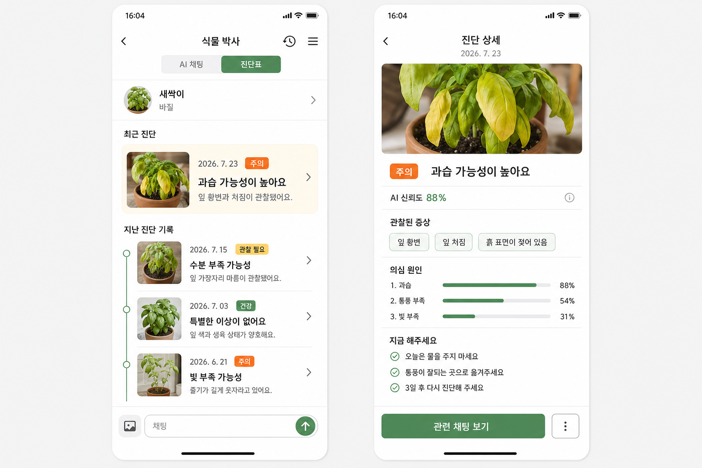

# 와이어프레임 1:1 매핑

이 문서는 2차 와이어프레임의 각 화면과 서버 데이터·API를 연결합니다.

## 화면별 매핑

| 영역 | 화면과 동작 | 서버 기준 |
|---|---|---|
| 온보딩 | 시작 화면 후 로그인 이동 | 서버 데이터 없음 |
| 로그인 | 이메일·비밀번호, Naver·Kakao·Apple | Supabase Auth SDK |
| 회원가입 | 이메일, 비밀번호·확인, 닉네임, 인증 링크 | Supabase Auth + `leafie_nickname` |
| 비밀번호 찾기 | 현재 이메일로 링크, 앱에서 새 비밀번호 입력 | Supabase recovery 딥링크 |
| OAuth 최초 로그인 | 이메일 필수, 닉네임 추가 입력 | `user_profiles.profile_completed_at` |
| 식물 기본정보 | 애칭과 지원 23종 중 정확한 식물명칭 | `plants`, `species_care_guides` |
| 식물 검색 | 내부 23종 이름·별칭 검색 | `GET /species` |
| 사진 인식 | 카메라·앨범 한 장, 분석, 맞아요·다시 검색 | `species_identifications`, Pl@ntNet Worker |
| 인식 확인 | 사진, 식물명, 학명, 과, 개화기 | 내부 카탈로그와 인식 후보 |
| 키우는 장소 | 장소 별명, 화분 6종, 위치 6종 | `plants` 환경 필드 |
| 초기 관리정보 | 시작일, 마지막 물 준 날, 분갈이 날짜·없음·모름 | 최초 `care_schedules`, `care_events` 생성 |
| 성격 | 외향적·시크·귀여움·짝사랑·내성적·충청도 | `plants.personality_type` |
| 꾸미기 | 컬러·헤어·장식 선택 | `color_id`, `hair_id`, `accessory_id` |
| 등록 완료 | 식물·일정·첫 대화 세션을 한 번에 생성 | 등록 트랜잭션 |
| 홈 | 현재 식물의 방, D+, 대사, 오늘·지연 할 일 | `GET /home` |
| 식물 전환 | 좌우 스와이프로 선택 식물 변경 | `PATCH /users/me/selected-plant` |
| 홈 컨디션 | 오늘 다이어리가 있으면 읽기 전용, 없으면 작성 이동 | `plant_diaries.condition_score` |
| 홈 메모 | 식물별 오늘 메모 한 개, 완료 체크 없음 | `plant_daily_memos` |
| 캐릭터 상세 | 읽기 전용 컨디션, 지연·오늘·미래 일정 | 식물 상세·agenda API |
| 정보 수정 | 애칭, 화분, 장소 별명, 위치 | `PATCH /plants/{id}` |
| 꾸미기 수정 | 컬러·헤어·장식 | `PATCH /plants/{id}/appearance` |
| 전체 캐릭터 | 식물 목록, 등록, 삭제 확인 | 식물 목록·삭제 API |
| 알림함 | 모든 식물 알림과 읽음 상태 | `notifications` |
| 월 캘린더 | 월 아이콘, 날짜 상세, 5종 필터 | calendar range API |
| 주 캘린더 | 선택 주의 일정과 완료 체크 | calendar range API |
| 과거 완료 | 실제 수행일 선택, 기록 시각은 서버가 저장 | `performed_on`, `recorded_at` |
| 다이어리 달력 | 작성일 아이콘과 월 평균 컨디션 | diary month API |
| 다이어리 작성 | 과거·오늘, 글·점수 필수, 사진 한 장 선택 | 날짜별 diary PUT |
| 다이어리 상세 | 사진, 글, 컨디션, 수정 | diary GET·PATCH |
| AI 채팅 | 현재 식물의 대화 세션, 텍스트·사진 | conversations, messages |
| 새 채팅·목록 | 현재 식물의 세션 생성·검색·삭제 | conversation API |
| 진단 시작 | 채팅에서 진단하기, 사진 한 장 | diagnosis 202 + Worker |
| 진단 이력 | 현재 식물의 모든 진단 최신순 | diagnosis list API |
| 진단 상세 | 사진·일자·상태·관찰·원인 TOP 3·추천 | diagnosis detail API |
| AI 일정 제안 | 비료·가지치기 제안 후 승인·취소 | `ai_actions` |
| 마이페이지 | 닉네임, 이메일, 가입일수, 계정 메뉴 | `GET /users/me` |
| 내 정보 수정 | 닉네임만 변경 | `PATCH /users/me` |
| 비밀번호 변경 | 현재 이메일로 변경 링크 전송 | Supabase Auth SDK |
| 로그아웃 | 확인 후 세션 제거 | Supabase Auth SDK |
| 회원 탈퇴 | 확인·재인증 후 비동기 삭제 | `DELETE /users/me` |
| 앱 알림 | 전체 푸시 ON/OFF | `push_enabled` |

## 공통 식물 컨텍스트

홈에서 선택한 식물은 홈, 캘린더, 다이어리와 AI의 기본 대상입니다. API는 명시적인
`plant_id`를 받아 소유권을 검증하고, `selected_plant_id`는 앱의 최초 화면 선택에만
사용합니다. AI 식물 태그는 만들지 않습니다.

## 화면에서 지켜야 할 규칙

1. 식물 종류 7개를 사용자가 고르는 UI는 제거하고 정확한 23종만 선택합니다.
2. 등록 인식 사진은 식물 대표 사진으로 재사용합니다.
3. 분갈이 `없음`과 `날짜 모름`, 위치·화분의 `기타`를 제공하되 기타 텍스트는 받지 않습니다.
4. 홈 메모에는 체크박스를 두지 않습니다.
5. 물주기·분갈이 완료일을 직접 수정하는 정보 수정 화면은 제거합니다.
6. 컨디션은 다이어리에서만 입력하고 홈·캘린더에서는 읽기 전용입니다.
7. 진단 이력 화면에는 `진단하기` 버튼을 두지 않습니다.
8. 진단 상세에서 건강점수, 단일 신뢰도와 점수 그래프를 제거합니다.
9. 추천 관리 앞의 원은 체크박스가 아닌 목록 표시입니다.
10. 마이페이지에서 프로필 사진과 한 줄 소개를 제거합니다.
11. 비밀번호 변경 화면의 이메일은 현재 계정 이메일을 읽기 전용으로 표시합니다.

## 필요한 상태 화면

- 이메일 인증 발송·완료·실패
- OAuth 닉네임 입력
- 비밀번호 재설정 발송·새 비밀번호·완료
- 식물 인식 분석 중·후보 없음·재촬영·외부 API 실패
- 등록 로컬 초안 이어하기·새로 시작
- 식물이 하나도 없는 홈
- 일정 중복 완료·소급 완료 실패
- 다이어리 없음·월 기록 없음
- 채팅 빈 화면·응답 중·사진 처리 실패
- 진단 처리 중·재촬영·실패·완료
- 알림 없음·OS 푸시 권한 거부
- 식물 삭제·로그아웃·회원 탈퇴 확인

## AI 진단 참고 이미지

이 이미지는 정보 구조 참고용이며 최종 디자인이 아닙니다.
